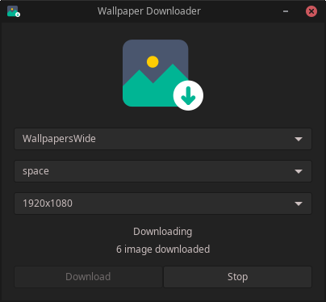

# Screenshot

  

### Usage
- Run "python3 main.py" in project directory

### Features
- image download on two separate sites (wallpaperswide, wallpaperscraft)
- set image category
- set picture resolution
